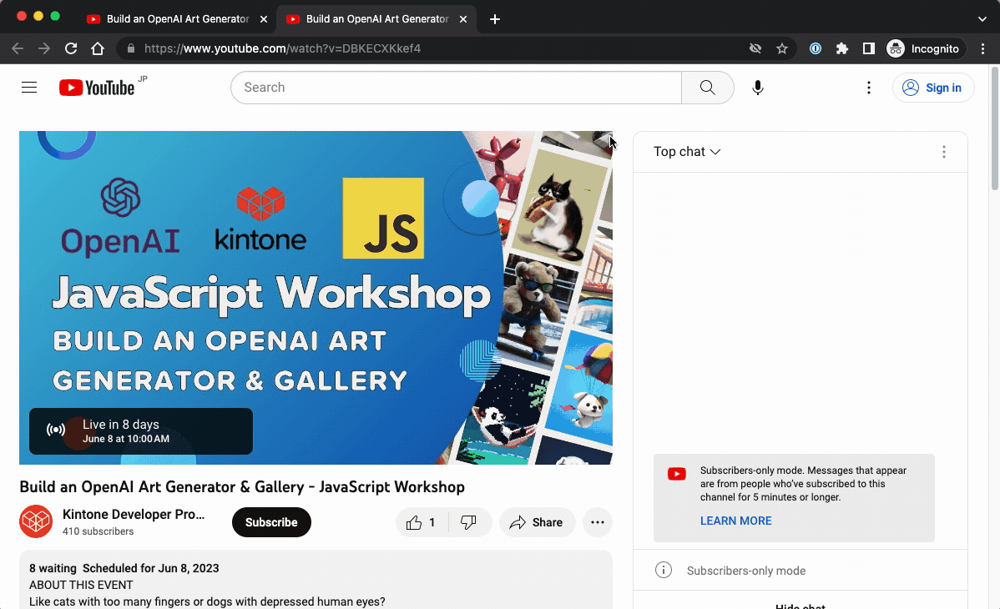

# Alfred Workflow - YouTube Short Link

## Description
Converts a YouTube URL to a short link using a simple script.

## Usage
1. Copy a YouTube URL to the clipboard.
1. Invoke Alfred.
1. Type `_short` and press `Enter`.
1. The short link will be copied to the clipboard.

## Installation
Download [YouTube_Short_Link.alfredworkflow](YouTube_Short_Link.alfredworkflow) and double-click to install.

## Demo

## Image

icon.png - [Youtube icons created by Ruslan Babkin - Flaticon](https://www.flaticon.com/free-icons/youtube "youtube icons")
